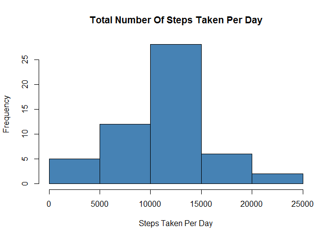
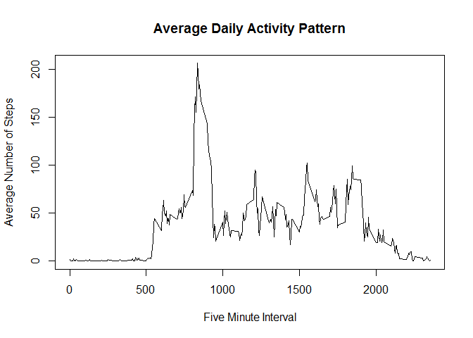
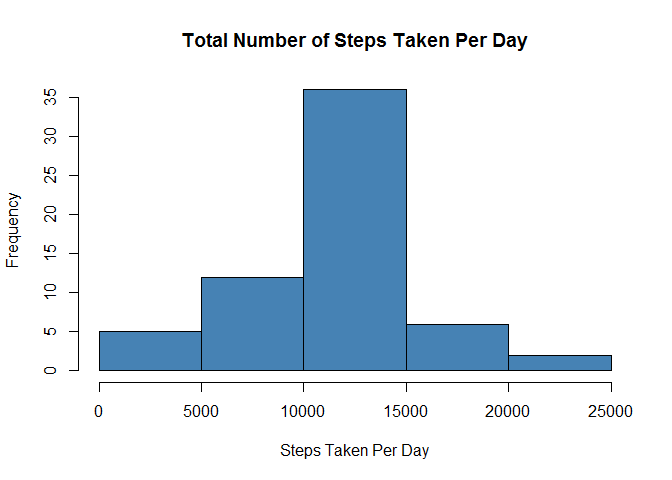
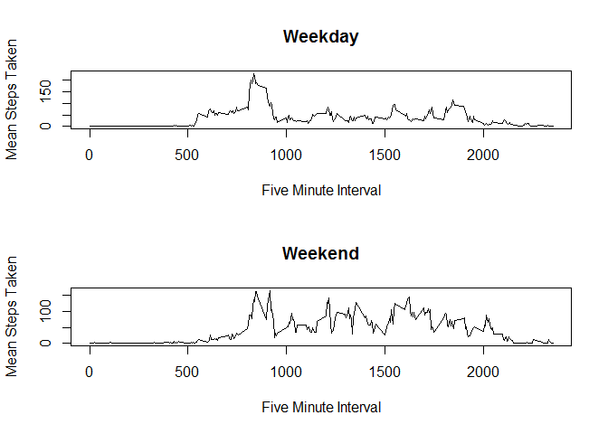

&nbsp;

### Loading and preprocessing the data


```r
data = read.csv("activity.csv", header = TRUE, sep = ",", na.strings = "NA")
```

&nbsp;

### What is mean total number of steps taken per day?

Calculate the total number of steps taken per day


```r
totalStep <- aggregate(data[complete.cases(data$steps), ]$steps, 
                    list(period = data[complete.cases(data$steps), 
                    ]$date), sum)
```

&nbsp;

Make a histogram of the total number of steps taken each day


```r
hist(totalStep$x, main = "Total Number Of Steps Taken Per Day",
     xlab = "Steps Taken Per Day", col = "steel blue")
```

<!-- -->

*Histogram looks somewhat symmetric which represents the total number of steps taken each day.*

&nbsp;

Calculate and report the mean and median of the total number of steps taken per day


```r
mean(totalStep$x)
```

```
## [1] 10766.19
```


```r
median(totalStep$x)
```

```
## [1] 10765
```

&nbsp;

### What is the average daily activity pattern?

Make a time series plot of the 5-minute interval and the average number of steps taken, averaged across all days.


```r
interval <- aggregate(data[complete.cases(data$steps), ]$steps, 
                      list(interval = data[complete.cases(data$steps), 
                      ]$interval), mean)

plot(interval$interval, interval$x, main = "Average Daily Activity Pattern", 
     type = "l", pch = "", ylab = "Average Number of Steps",
     xlab = "Five Minute Interval")
```

<!-- -->

*A sudden shift in the series takes place at around 500 (05:00), spikes up at around 0800 (08:00), and starts to die down at around 2000 (20:00). The time series basically describes the normal waking and sleeping hours of the indivdual. Travel to work perhaps explains the sudden spike in the number of steps taken.*

&nbsp;

Which 5-minute interval, on average across all the days in the dataset, contains the maximum number of steps?


```r
interval[interval$x == max(interval$x), ]$interval
```

```
## [1] 835
```

&nbsp;

### Imputing missing values

Calculate and report the total number of missing values in the dataset.


```r
sum(is.na(data$steps))
```

```
## [1] 2304
```

&nbsp;

Devise a strategy for filling in all of the missing values in the dataset.

Use the mean total number of steps per day to fill the missing values.


```r
merged <- merge(data, interval, by = "interval")

imputed <- transform(merged, steps = ifelse(is.na(steps), x, steps))
```

&nbsp;

Create a new dataset that is equal to the original dataset but with the missing data filled in.


```r
newTotal <- aggregate(imputed[complete.cases(imputed$steps), ]$steps, 
                    list(period = imputed[complete.cases(imputed$steps), 
                    ]$date), sum)
```

&nbsp;

Make a histogram of the total number of steps taken each day and calculate and report the mean and median total number of steps taken per day. 


```r
hist(newTotal$x, main = "Total Number of Steps Taken Per Day", 
     xlab = "Steps Taken Per Day", col = "steel blue")
```

<!-- -->

*The histogram maintained a somewhat symmetrical shape similar to the previous one. A slight increase in the frequency is evident.*

&nbsp;

Do these values differ from the estimates from the first part of the assignment? What is the impact of imputing missing data on the estimates of the total daily number of steps?


```r
mean(newTotal$x)
```

```
## [1] 10766.19
```


```r
median(newTotal$x)
```

```
## [1] 10766.19
```

*With the missing value filled with the mean value, median is now equal to the mean.*

&nbsp;

### Are there differences in activity patterns between weekdays and weekends?

Create a new factor variable in the dataset with two levels – “weekday” and “weekend” indicating whether a given date is a weekday or weekend day.


```r
imputed <- transform(imputed, weekday = ifelse(weekdays(as.Date(date)) 
                == "Sunday" | weekdays(as.Date(date)) == "Saturday", 
                "Weekend", "Weekday"))

newInterval <- aggregate(imputed[complete.cases(imputed$steps), 
                      ]$steps, list(interval = imputed[complete.cases(imputed$steps), 
                      ]$interval, day = imputed[complete.cases(imputed$steps),
                      ]$weekday), mean)
```

&nbsp;

Make a panel plot containing a time series plot of the 5-minute interval (x-axis) and the average number of steps taken, averaged across all weekday days or weekend days (y-axis). 


```r
par(mfrow = c(2, 1))

plot(newInterval[newInterval$day == "Weekday", ]$interval, 
     newInterval[newInterval$day == "Weekday", ]$x, type = "l", 
     main = "Weekday", font.main = 2, pch = "", ylab = "Mean Steps Taken", 
     xlab = "Five Minute Interval")


plot(newInterval[newInterval$day == "Weekend", ]$interval, 
     newInterval[newInterval$day == "Weekend", ]$x, type = "l", 
     main = "Weekend", font.main = 2, pch = "", ylab = "Mean Steps Taken", 
     xlab = "Five Minute Interval")
```

<!-- -->

*This validates our earlier theory where travel to work could explain the sudden spike in the total number of steps taken. Notice the peak is at its highest during weekdays.*
